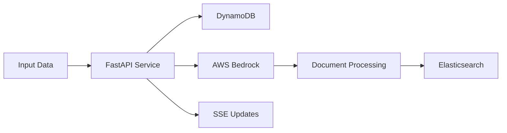

# Welcome to Generative Indexing 🚀

Welcome to the official documentation for the Generative Indexing service. This documentation will help you understand, set up, and use our powerful data processing and indexing pipeline.

## What is Generative Indexing?

Generative Indexing is a FastAPI-based service that transforms raw user data into AI-enriched, searchable documents using AWS Bedrock and Elasticsearch. The service provides:

- 🔄 Real-time processing status updates via SSE
- 📄 Support for multiple input formats (JSON, JSONL, CSV, TXT)
- 🤖 AI-powered document enhancement using AWS Bedrock
- 🔍 Efficient document indexing with Elasticsearch
- 🎯 Integration with AWS DynamoDB for metadata management

## Quick Links

- 📚 [Getting Started](getting-started/installation.md)
- 🏗️ [Architecture Overview](architecture/overview.md)
- 🔌 [API Reference](api/endpoints.md)
- 🚀 [Deployment Guide](deployment/prerequisites.md)
- 👥 [Contributing Guidelines](contributing/guidelines.md)

## System Architecture

## Features

### Real-time Progress Updates
Track document processing and indexing progress in real-time through Server-Sent Events (SSE).

### Multi-format Support
Process various file formats with intelligent chunking:
- JSON and JSONL files
- CSV data
- Plain text documents

### AI-Powered Processing
Leverage AWS Bedrock's Anthropic models for:
- Document enhancement
- Content structuring
- Metadata extraction

### Elasticsearch Integration
Efficient document indexing with:
- Bulk processing support
- Configurable mappings
- Optimized search capabilities

### DynamoDB Integration
Seamless user metadata management:
- User-specific configurations
- Processing history
- Status tracking

## Get Started

Ready to begin? Check out our [Quick Start Guide](getting-started/quickstart.md) to set up your first indexing pipeline!