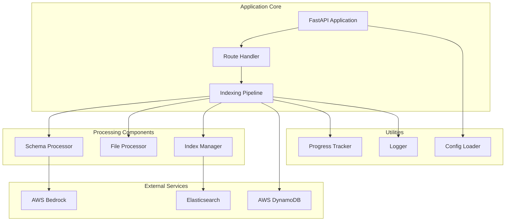
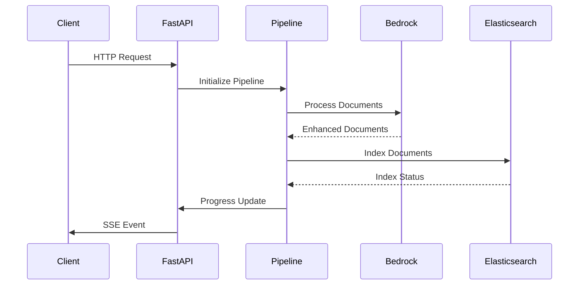
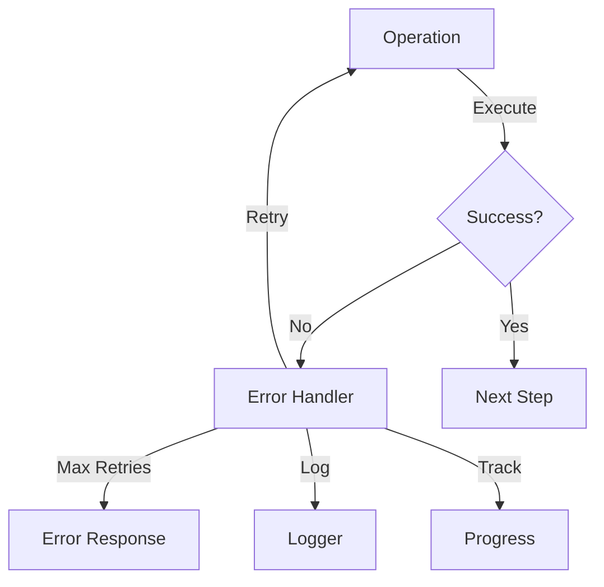

# System Components

This document details the core components of the Generative Indexing system and their interactions.

## Component Architecture



## Component Details

### 1. FastAPI Application (`app/main.py`)
```python
from fastapi import FastAPI
from fastapi.middleware.cors import CORSMiddleware

app = FastAPI(
    title="Generative Indexing",
    description="AI-powered document processing and indexing service",
    version="1.0.0"
)

# CORS Configuration
app.add_middleware(
    CORSMiddleware,
    allow_origins=["*"],
    allow_credentials=True,
    allow_methods=["*"],
    allow_headers=["*"],
)
```

### 2. Indexing Pipeline (`app/services/indexing_pipeline.py`)
```python
class IndexingPipeline:
    def __init__(self):
        self.bedrock = BedrockService()
        self.dynamodb = DynamoDBService()
        self.elasticsearch = ElasticsearchService()
        self.schema_processor = SchemaProcessor()
        
    async def process(self, data_path: str) -> AsyncGenerator:
        # Pipeline implementation
        pass
```

### 3. AWS Services Integration

#### Bedrock Service (`app/services/bedrock_model_service.py`)
```python
class BedrockService:
    def __init__(self):
        self.client = boto3.client('bedrock-runtime')
        
    async def process_document(self, content: str) -> dict:
        # Document processing implementation
        pass
```

#### DynamoDB Service (`app/services/dynamo_db_service.py`)
```python
class DynamoDBService:
    def __init__(self):
        self.client = boto3.resource('dynamodb')
        self.table = self.client.Table(settings.dynamodb_table)
        
    async def get_user_metadata(self, user_id: str) -> dict:
        # Metadata retrieval implementation
        pass
```

#### Elasticsearch Service (`app/services/elasticsearch_service.py`)
```python
class ElasticsearchService:
    def __init__(self):
        self.client = Elasticsearch(
            hosts=[settings.elasticsearch_host],
            basic_auth=(settings.elasticsearch_user, 
                       settings.elasticsearch_password)
        )
        
    async def bulk_index(self, documents: List[dict]) -> dict:
        # Bulk indexing implementation
        pass
```

### 4. Processing Components

#### Schema Processor (`app/processors/schema_processor.py`)
```python
class SchemaProcessor:
    def __init__(self):
        self.validator = SchemaValidator()
        
    def process_document(self, document: dict) -> dict:
        # Schema processing implementation
        pass
```

#### File Processor (`app/utils/file_utils.py`)
```python
class FileProcessor:
    def __init__(self, chunk_size: int = 1000):
        self.chunk_size = chunk_size
        
    async def process_file(self, file_path: str) -> AsyncGenerator:
        # File processing implementation
        pass
```

## Component Interactions

### 1. Request Flow



### 2. Data Processing Flow


### 3. Error Handling



## Configuration Integration

### 1. Environment Variables
```python
class Settings(BaseSettings):
    # AWS Settings
    aws_region: str
    aws_access_key_id: str
    aws_secret_access_key: str
    
    # Elasticsearch Settings
    elasticsearch_host: str
    elasticsearch_port: int
    elasticsearch_user: str
    elasticsearch_password: str
    
    # Application Settings
    app_host: str = "0.0.0.0"
    app_port: int = 8000
    log_level: str = "INFO"
```

### 2. YAML Configuration
```yaml
aws:
  region: ${AWS_REGION}
  bedrock_model_id: ${AWS_BEDROCK_MODEL_ID}
  
elasticsearch:
  host: ${ES_HOST}
  port: ${ES_PORT}
  
app:
  chunk_size: 1000
  docs_per_batch: 50
```

## Monitoring and Logging

### 1. Structured Logging
```python
logger = structlog.get_logger()

logger.info(
    "processing_document",
    document_id=doc_id,
    status="success",
    processing_time=elapsed_time
)
```

### 2. Progress Tracking
```python
class ProgressTracker:
    def __init__(self):
        self.total = 0
        self.processed = 0
        
    def update(self, count: int):
        self.processed += count
        return {
            "status": "processing",
            "progress": f"{self.processed}/{self.total}"
        }
```

This comprehensive component documentation provides:
- Detailed component descriptions
- Code examples
- Interaction diagrams
- Configuration details
- Monitoring setup

Each component is designed to be:
- Modular and reusable
- Well-documented
- Easy to maintain
- Properly configured
- Error-resilient