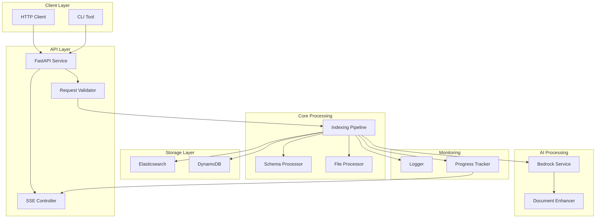
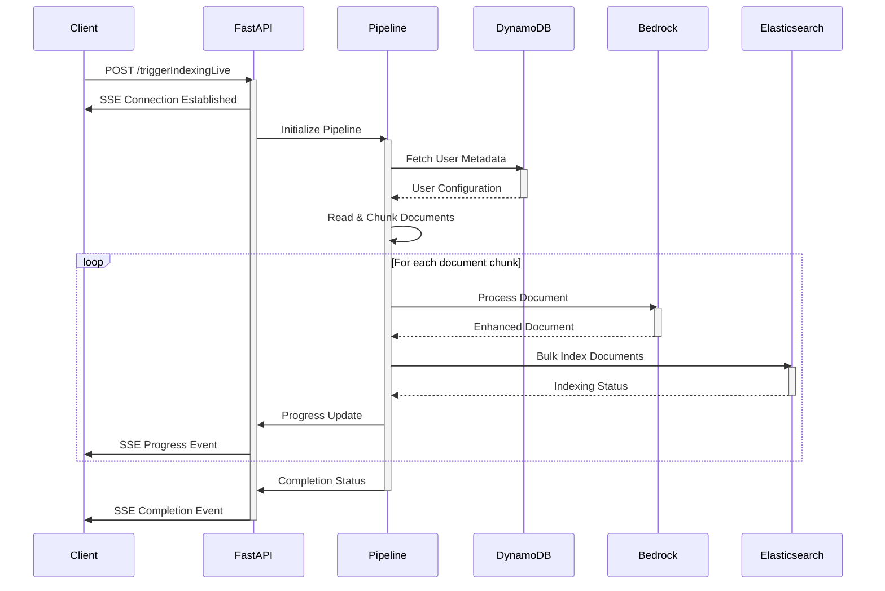
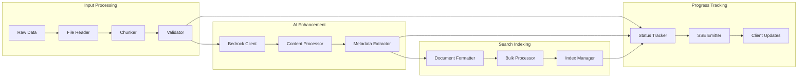
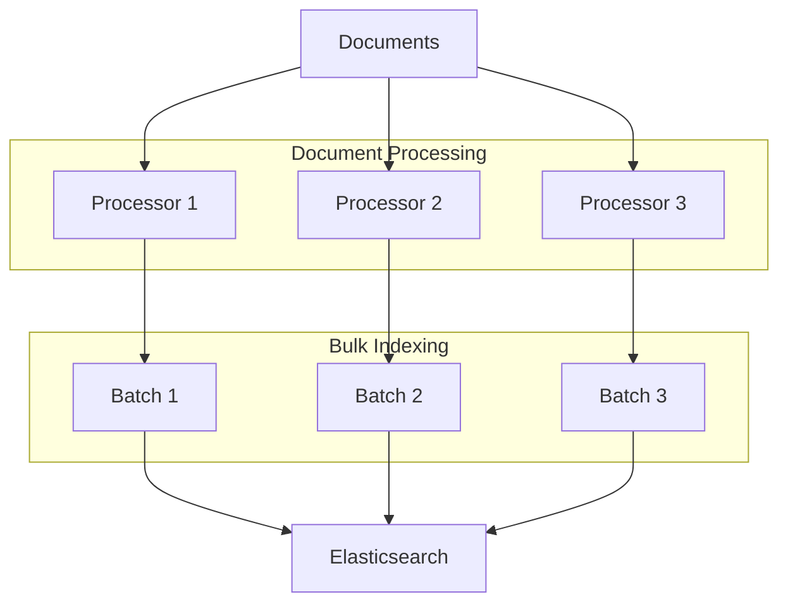
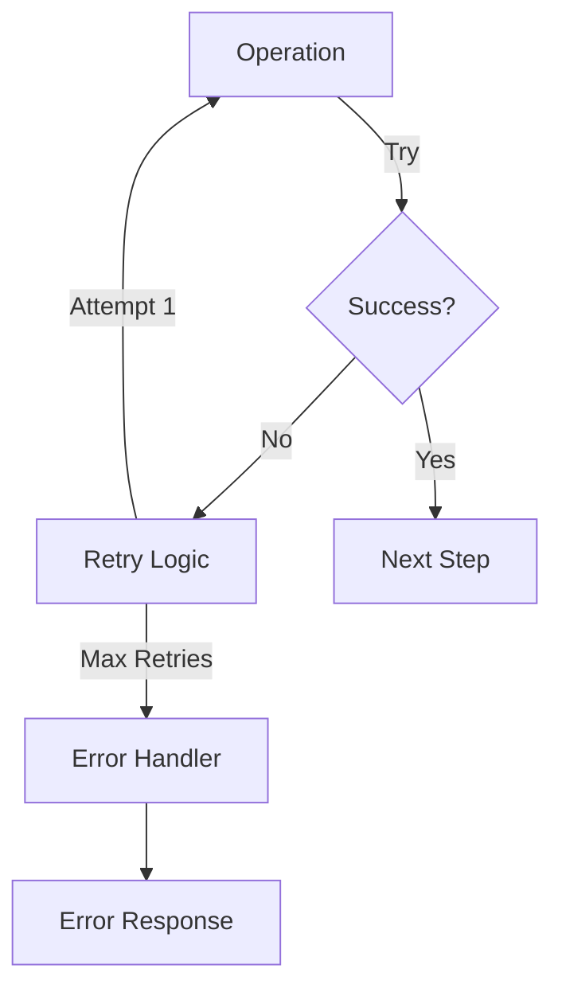
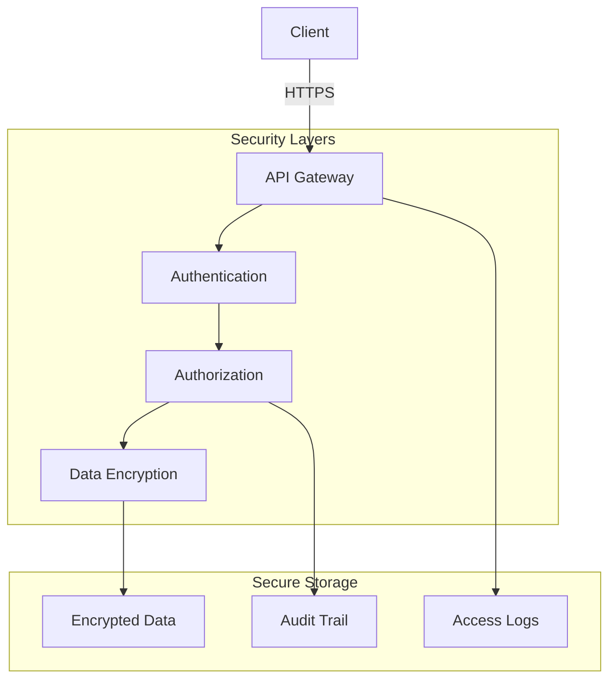

# System Architecture & Flow

This document provides a detailed overview of the Generative Indexing system architecture and data flow.

## High-Level Architecture



## Detailed Component Flow



## Data Processing Pipeline



## System Components

### 1. Client Layer
- HTTP clients for API interaction
- CLI tools for batch processing
- SSE clients for real-time updates

### 2. API Layer
- FastAPI service handling requests
- Request validation and routing
- SSE controller for streaming updates
- Error handling and response formatting

### 3. Core Processing
- Document chunking and validation
- Schema processing and transformation
- Pipeline orchestration
- Error recovery and retry logic

### 4. AI Processing
- AWS Bedrock integration
- Document enhancement logic
- Content structuring
- Metadata extraction

### 5. Storage Layer
- Elasticsearch for document storage and search
- DynamoDB for user metadata and configurations
- Bulk operations handling
- Connection management

### 6. Monitoring
- Structured logging
- Progress tracking
- Status updates
- Error reporting

## Data Flow Description

1. **Input Stage**
   ```mermaid
   graph LR
       A[Input File] -->|Read| B[File Processor]
       B -->|Chunk| C[Document Chunks]
       C -->|Validate| D[Valid Documents]
   ```

2. **Processing Stage**
   ```mermaid
   graph LR
       A[Valid Documents] -->|Enhance| B[Bedrock AI]
       B -->|Extract| C[Metadata]
       B -->|Structure| D[Content]
       C --> E[Final Document]
       D --> E
   ```

3. **Storage Stage**
   ```mermaid
   graph LR
       A[Final Documents] -->|Batch| B[Bulk Processor]
       B -->|Index| C[Elasticsearch]
       B -->|Store Metadata| D[DynamoDB]
   ```

## Performance Considerations

### Parallel Processing


### Error Handling


## Security Architecture



This architecture ensures:
- Scalable processing
- Real-time updates
- Error resilience
- Secure operations
- Monitoring capabilities
- Data consistency