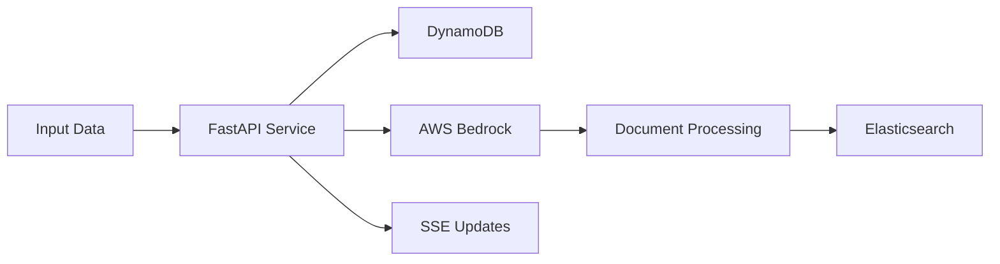
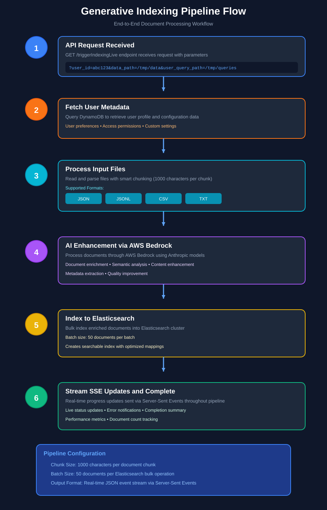

# Generative Indexing 🚀

[](https://fastapi.tiangolo.com)
[](https://www.python.org)
[](https://www.elastic.co)
[](https://aws.amazon.com)

A powerful FastAPI-based service that transforms raw user data into AI-enriched, searchable documents using AWS Bedrock and Elasticsearch. This pipeline seamlessly integrates document processing, AI enhancement, and search indexing capabilities.

## ✨ Key Features

- 🔄 **Real-time Progress Updates** - Stream processing status via Server-Sent Events (SSE)
- 📄 **Multi-format Support** - Process JSON, JSONL, CSV, and TXT files with smart chunking
- 🤖 **AI-Powered Processing** - Leverage AWS Bedrock with Anthropic models for document enhancement
- 🔍 **Elasticsearch Integration** - Create and manage searchable indices with bulk processing
- 🎯 **DynamoDB Integration** - Fetch and process user metadata from AWS DynamoDB

## 🏗️ Architecture




This architecture diagram illustrates the complete system flow, showing how different components interact with each other.

## 📦 Requirements

- Python 3.10+
- Key Dependencies:
  - `fastapi` - Web framework
  - `uvicorn` - ASGI server
  - `boto3` - AWS SDK
  - `elasticsearch` - Search engine client
  - `PyYAML` - Configuration management

## 🚀 Quick Start

### 1. Set Up Environment

```bash
# Create and activate virtual environment
python3 -m venv indexing-agent
source indexing-agent/bin/activate

# Install dependencies
pip install -r requirements.txt
```

### 2. Configure Application

Edit `app/config/config.yaml` with your settings:

```yaml
aws:
  region: your-region
  bedrock_model_id: your-model-id
  dynamodb:
    table_name: your-table

elasticsearch:
  host: localhost
  port: 9200
  username: elastic
  password: your-password
  default_index: your-index

app:
  host: 0.0.0.0
  port: 8000
  chunk_size: 1000
  docs_per_batch: 50
```

### 3. Launch Application

```bash
# Production
python -m app.main

# Development with hot reload
uvicorn app.main:app --reload --host 0.0.0.0 --port 8000
```

## 🔌 API Reference

### Trigger Indexing

```http
GET /triggerIndexingLive
```

**Query Parameters:**
- `user_id` - Unique identifier for the user
- `data_path` - Path to input data file
- `user_query_path` - Path to user queries file

**Example:**
```bash
curl -N "http://localhost:8000/triggerIndexingLive?user_id=abc123&data_path=/tmp/&user_query_path=/tmp/"
```

The endpoint streams JSON events for each pipeline stage:
1. DynamoDB metadata fetch
2. File processing
3. Bedrock AI enhancement
4. Elasticsearch indexing
5. Final summary

## 📁 Project Structure

```
generativeindexing/
├── app/
│   ├── main.py                  # FastAPI entry point
│   ├── config/
│   │   ├── config.yaml          # Configuration
│   │   └── config_loader.py     # Config parser
│   ├── routes/
│   │   └── indexing.py          # API endpoints
│   ├── services/
│   │   ├── bedrock_model_service.py    # AWS Bedrock integration
│   │   ├── dynamo_db_service.py        # DynamoDB client
│   │   └── elasticsearch_service.py     # Elasticsearch client
│   ├── processors/
│   │   └── schema_processor.py  # Schema validation
│   └── utils/
│       ├── file_utils.py        # File operations
│       └── logger.py            # Logging setup
└── requirements.txt             # Dependencies

```
## 🔒 Security Considerations

- 🔑 **Credentials**: Store secrets in environment variables or use AWS Secrets Manager
- 🛡️ **API Security**: Deploy behind a reverse proxy with TLS/SSL enabled
- 🔐 **Access Control**: Implement proper authentication for production deployments

## 🔧 Troubleshooting

- **AWS Credentials**: Ensure proper setup via environment variables, credentials file, or IAM roles
- **Elasticsearch Connection**: Verify cluster health and network connectivity
- **Bedrock Integration**: Confirm proper model ID configuration in YAML

## 🛣️ Roadmap

- [ ] Add comprehensive test suite
- [ ] Implement Docker support
- [ ] Add sample configuration templates
- [ ] Enhance error handling and recovery
- [ ] Add monitoring and alerting
- [ ] Implement rate limiting

## 📝 License

This project is licensed under the MIT License - see the LICENSE file for details.

## 🤝 Contributing

Contributions are welcome! Please feel free to submit a Pull Request.

1. Fork the repository
2. Create your feature branch (`git checkout -b feature/AmazingFeature`)
3. Commit your changes (`git commit -m 'Add some AmazingFeature'`)
4. Push to the branch (`git push origin feature/AmazingFeature`)
5. Open a Pull Request

---

## 🔄 Processing Flow



This flow diagram shows the step-by-step processing of documents through the system, from input to final indexing.

---

Made with ❤️ by [HarshitSharma2001](https://github.com/HarshitSharma2001)
